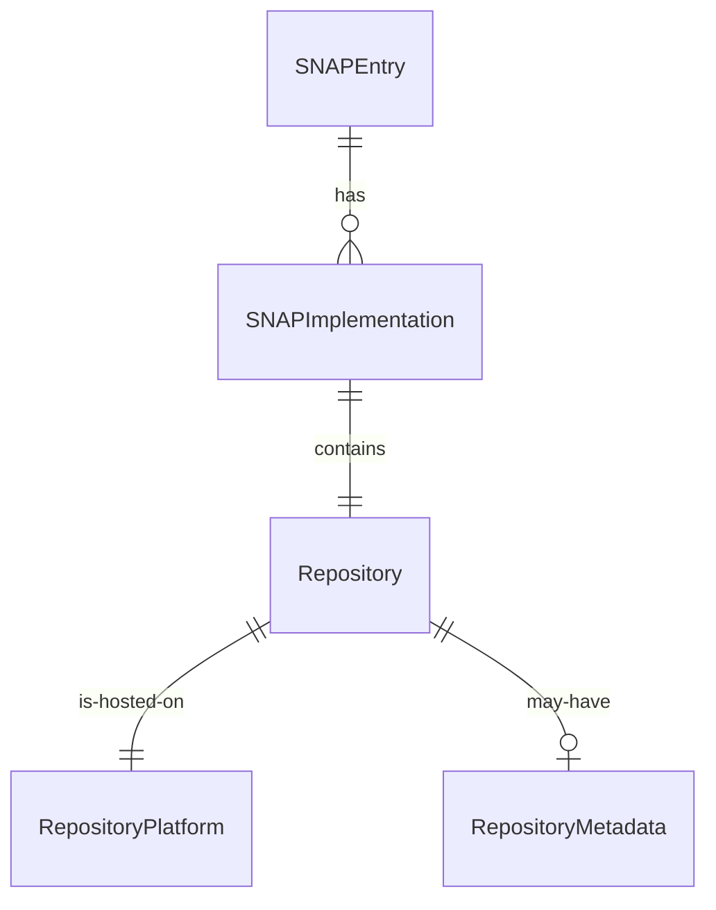

# Data Model: GitLab.com Repository Support

## Core Entities

### 1. RepositoryPlatform (Enum)
Identifies the hosting platform for a repository.

**Values**:
- `GITHUB` - GitHub.com hosted repository
- `GITLAB` - GitLab.com hosted repository

**Validation Rules**:
- Must be one of the defined values
- Required for all repository entries

### 2. RepositoryMetadata
Normalized metadata structure for repositories across platforms.

**Fields**:
| Field | Type | Required | Description | Validation |
|-------|------|----------|-------------|------------|
| `stars` | number | Yes | Star/favorite count | >= 0 |
| `description` | string | No | Repository description | Max 500 chars |
| `primaryLanguage` | string | No | Main programming language | Valid language name |
| `lastUpdated` | ISO 8601 string | Yes | Last activity timestamp | Valid date |
| `forks` | number | Yes | Fork count | >= 0 |
| `openIssues` | number | Yes | Open issues count | >= 0 |
| `defaultBranch` | string | Yes | Default branch name | Non-empty string |

### 3. Repository
Complete repository information including platform-specific data.

**Fields**:
| Field | Type | Required | Description | Validation |
|-------|------|----------|-------------|------------|
| `url` | string | Yes | Full repository URL | Valid GitHub/GitLab URL |
| `platform` | RepositoryPlatform | Yes | Hosting platform | Valid enum value |
| `owner` | string | Yes | Repository owner/org | Extracted from URL |
| `name` | string | Yes | Repository name | Extracted from URL |
| `metadata` | RepositoryMetadata | No | Fetched metadata | Valid when available |
| `fetchedAt` | ISO 8601 string | No | When metadata was fetched | Valid date |
| `fetchError` | string | No | Error message if fetch failed | Present when metadata unavailable |

### 4. SNAPImplementation
Language-specific implementation of a SNAP.

**Fields**:
| Field | Type | Required | Description | Validation |
|-------|------|----------|-------------|------------|
| `language` | string | Yes | Programming language | Non-empty |
| `repository` | Repository | Yes | Repository information | Valid repository |
| `version` | string | No | Implementation version | Semantic version |
| `specVersion` | string | Yes | SNAP spec version | Semantic version |

### 5. SNAPEntry (Enhanced)
Updated SNAP catalogue entry supporting multiple platforms.

**Fields**:
| Field | Type | Required | Description | Validation |
|-------|------|----------|-------------|------------|
| `name` | string | Yes | SNAP name | Non-empty, unique |
| `description` | string | Yes | SNAP description | Max 500 chars |
| `category` | string | Yes | SNAP category | Valid category |
| `implementations` | SNAPImplementation[] | Yes | Language implementations | At least one |
| `maintainer` | string | Yes | Maintainer info | Non-empty |
| `addedDate` | ISO 8601 string | Yes | When added to catalogue | Valid date |

## State Transitions

### Repository Metadata States
```
UNFETCHED → FETCHING → FETCHED
          ↓          ↓
          → ERROR ←
```

**Transitions**:
1. **UNFETCHED → FETCHING**: Initiated when repository URL added
2. **FETCHING → FETCHED**: Successful API response
3. **FETCHING → ERROR**: API failure or timeout
4. **ERROR → FETCHING**: Retry attempt
5. **FETCHED → FETCHING**: Refresh/update triggered

## Relationships



## Validation Rules

### URL Validation
- **GitHub Pattern**: `^https://github\.com/[\w\-\.]+/[\w\-\.]+$`
- **GitLab Pattern**: `^https://gitlab\.com/[\w\-\.]+(/[\w\-\.]+)*$`
- Must be HTTPS (not HTTP)
- No trailing slashes
- No `.git` extension

### Cross-Entity Validation
1. **Unique Repository URLs**: No duplicate repository URLs within a SNAP entry
2. **Language Uniqueness**: Each implementation must have a unique language
3. **Platform Consistency**: URL must match declared platform
4. **Metadata Freshness**: Fetched metadata older than 7 days triggers refresh

## Migration Strategy

### From Current Structure
Current `snaps.json` structure uses direct GitHub URLs. Migration requires:

1. **Parse existing URLs** → Extract platform (all currently GitHub)
2. **Create Repository objects** → Wrap URLs in new structure
3. **Mark for metadata fetch** → Set all as UNFETCHED initially
4. **Backward compatibility** → Support old format during transition

### Migration Script Pseudocode
```
for each snap in snaps.json:
  for each implementation:
    if implementation.repository is string (old format):
      implementation.repository = {
        url: implementation.repository,
        platform: detectPlatform(url),
        owner: extractOwner(url),
        name: extractName(url),
        metadata: null,
        fetchedAt: null
      }
```

## Storage Format

### JSON Structure (snaps.json)
```json
{
  "snaps": [
    {
      "name": "TaskQueueSnap",
      "description": "Distributed task queue",
      "category": "Queue",
      "implementations": [
        {
          "language": "Java",
          "repository": {
            "url": "https://github.com/user/taskqueue-java",
            "platform": "GITHUB",
            "owner": "user",
            "name": "taskqueue-java",
            "metadata": {
              "stars": 42,
              "description": "Task queue SNAP for Java",
              "primaryLanguage": "Java",
              "lastUpdated": "2024-01-15T10:30:00Z",
              "forks": 5,
              "openIssues": 3,
              "defaultBranch": "main"
            },
            "fetchedAt": "2024-01-20T08:00:00Z"
          },
          "version": "1.0.0",
          "specVersion": "0.1.0"
        },
        {
          "language": "Python",
          "repository": {
            "url": "https://gitlab.com/user/taskqueue-python",
            "platform": "GITLAB",
            "owner": "user",
            "name": "taskqueue-python",
            "metadata": null,
            "fetchError": "Rate limited"
          },
          "version": "1.0.0",
          "specVersion": "0.1.0"
        }
      ],
      "maintainer": "user@example.com",
      "addedDate": "2024-01-01T00:00:00Z"
    }
  ]
}
```

## Index Requirements

### Search Indices
1. **By Platform**: Quick filtering by GitHub/GitLab
2. **By Language**: Filter implementations by language
3. **By Category**: Existing category filtering
4. **By Fetch Status**: Identify repositories needing metadata refresh

### Sort Orders
1. **By Stars**: Total stars across all implementations
2. **By Last Updated**: Most recently active repository
3. **By Name**: Alphabetical (existing)
4. **By Date Added**: Newest first (existing)